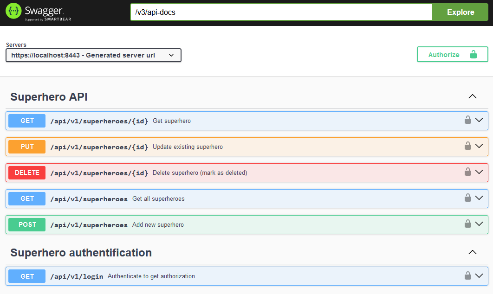

# Superhero Spring Boot RESTful API
A RESTful API etude, using Spring 6.* , Spring Boot 3.* to find solutions and build tests as example code. 

You could get data calling e.g. `/api/v1/superheroes` and other endpoints. Prior get a JWT token. You can run unit, functional and integrative tests using oci container solution ("Testconainers" feature of spring boot). 

## Start project in your docker environment 🐋

👆 You will need docker/ docker-compose installed on your os. 

`.bin/start.sh`

This will make an image of project, start a docker network, initialize a postgres database and provide localhost, TLS at port 8443.

* Use some rest client: `GET https://localhost:8443/api/v1/superheros/ HTTP/1.1` (Please use JWT).

* See openapi definition at https://localhost:8443/swagger-ui/index.html . (Please write `index.html`, there is no redirect)

## Using JWT 

1. Get a token by authentification

        GET https://localhost:8443/login HTTP/1.1
        Authorization: Basic admin@example.com foobar

2. You will receive an authorisation as JWT in payload of response body. 

3. Use JWT 

        GET https://localhost:8443/api/v1/superheroes HTTP/1.1
        Authorization: Bearer {{your-jwt-token}}

* Administrator role: 
  * user: admin@example.com
  * password: foobar
* User role: 
  * user: chris@example.com
  * password: foobar

## Developing (using hot swapping of code) 🔧

1. You will need docker/ docker-compose installed on your os. 

2. Start application: `.bin/mvn-spring-boot-run.sh`
- Postgres database will be started and fully initialized in a docker container.
- spring-boot will be started.

3. Run test by `mvn clean test`.

4. Open database client on `psql postgresql://db:db@localhost:15432/db`.

### Stop and Restart for Development ⚙️

1. You can stop database container by `.bin/stop-database-container.sh`.
2. You can delete database container and loose all database changes by `.bin/delete-database-container.sh`, default schema and data will be restored next start.

## Cleaning records 🧹

A sheduler will do the job for you.

Manually: 
- activate shell by configuration `spring.shell.interactive.enabled: true`.
- enter container or development console, wait for `shell:>`.
- type `manually-erase-marked-as-deleted` to delete records, which are marked as `deleted` by API DELETE endpoint request.

## Features 0.2.0 ✨

* Soft delete
* Database postgres + docker
* JWT auth, roles
* Tests (using testcontainers)
* Soft-delete and scheduling to erase records

        👆 DELETE endpoint only marks record as deleted, use cleaning records to really delete records.

#### Endpoints
##### Superheroes
* GET /api/v1/superheroes
* GET /api/v1/superheroes/{id}
* POST /api/v1/superheroes
* PUT /api/v1/superheroes/{id}
* DELETE /api/v1/superheroes/{id} 

##### Authentification
* GET /api/v1/login

## Plans for 0.3.0 ⏳

* use other entities to complete object network
* optimize jwt claim to better store user roles
* refresh token